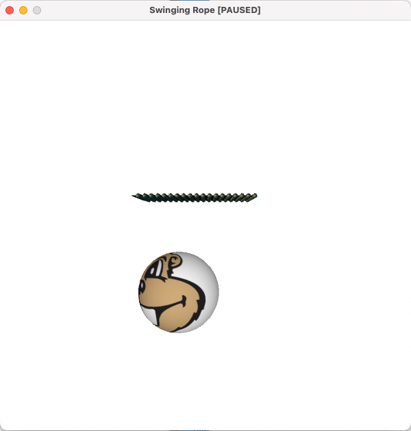

# Project 2
Team memeber:
Zecheng Qian (qian0102@umn.edu)

## Part 1

### Demos

+ 
+ [Video Link](demo/demo_video.mov)

### Features
+ Multiple Ropes: The number of (independent) ropes can be adjusted by setting the parameter `numRopes` in the code, currently there are 30 ropes and 20 nodes on each rope (for cloth simulation)
+ Cloth Simulation: The cloth is simulated with a group of springs connecting to each other, the cloth falls naturally on a sphere, the force includes air drag, gravity, damping force and spring force
+ 3D Simulation: The camera (view point) orientation can be adjust by commands `W`, `A`, `S`, `D`, `Q`, `E`, $\leftarrow$, $\rightarrow$, $\uparrow$, $\downarrow$
+ High-quality Rendering: I use texturing and 3D lighting for the static ball and the nodes on ropes
+ Air Drag for Cloth: The air drag term is introduced into the model by using the formula from the class
+ User Interaction: I implemented the user interaction on part2 simulations instead
+ Realistic Speed: I recorded a video demonstrating the simulation speed of my program: [Video Link](demo/demo_video.mov)

### Code Link
[cloth.pde](cloth.pde)

### List of the tools/library you used
+ Skeleton code from `RopeStarter_Vec2.pde`
+ Camera library on Canvas
### Write-up explaining difficulties you encountered 
+ Triangulation of the cloth, in order to apply to air drag, we need to have 3 points to form a triangle, doing triangulation is not very intuitive with such a model
+ Simulation with more ropes and more balls on each rope can cause the program to run slowly
+ Converting between coordinate systems is not easy, when dealing with mouse clicking events, the mouse's coordinates are relative to the canvs but objects in the scene has another 3D world coordinates with the camera as its origin

### One or more images/videos showcasing features of your simulation
Please check the demo section above: [Video Link](demo/demo_video.mov)

